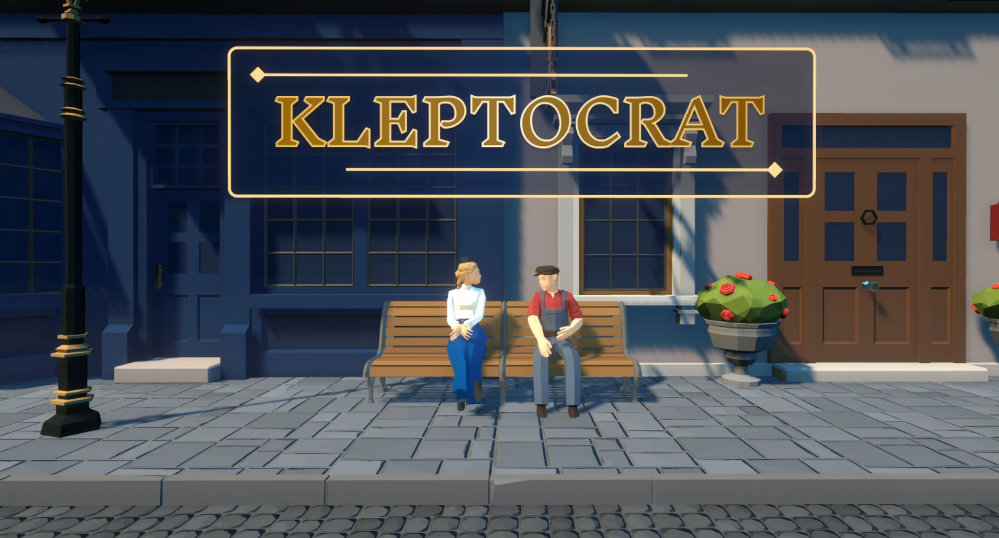

<h1 align="center"> Kleptocrat</h1>
<h4 align="center">A steath-type game - VGD Spring 2024 class showcase</h4> 
<h3 align="center">Game Trailer Here!</h3>

### Thanks to the Team
Huge appreciation to everyone in the team for such a rewarding project experience. I learned a lot from every team member, most notably:
- Tom - solid systems + framework authoring for the game/sound/scene managers, event systems, 
- Erik - motion capture expert and go-to for the player controller nuances. Was fun working with you to figure out the PhysX engine and leveraging it for our players, AI and interactable objects.
- Martin - The focus on learning the tools properly, whether it's Unity-specific programming patterns like Scriptable Objects, or game lighting industry standards, and upholding high standards for gameplay experience and HUD for the user.
- cofefe - Essential UI creation and level details (ambience, sounds, set dressing) which added that extra polish to the game. Inspired to try shaders in Unity's shadergraph due to your push for learnings in computer graphics.

### Justin's Manifest

The following is an outline of contributions that I made to the Video Game Design project. I contributed crucially to the AI algorithms - AI state behavior, navigation, animation, gameplay mechanics. Working with the team, I contributed lesser to game/event systems, player controller, HUD and overall level design/layout.

I limited sharing of all source material due to class course policy.

**Algorithm Contributions** 

* Authored Hierarchical FSM system for AI behavior states
* Audio sensory through sound listener based on listening radius
* FOV Sight sensory using physics radius, view angle & non-blocked raycasting from AI head to player 
* FOV conic view visualisation through dynamic mesh renderer
* 2D root-motion blended movement integrated into the navigational mesh, with waypoint navigation
* Threat-meter based behavior switching system, and UI displaying threat bar
* AI Manager creating events in Scriptable Object (highest elevated AI hostile state, AI requests player caught)

**Other Script contributions**

* Fixed player control bugs using Rigid body force/velocity instead of direct transform updates
* ScriptableObject communication for player/AI/gameplay
* Trigger scripts for doors, sounds, collapsing boxes and hiding zones
* Improved Erik’s footstep emitter- now the randomized collection-based footsteps can be chosen based on passed-in ground surface + movement type 

**Other contributions**
* Level whiteboxing and set decoration
* Trailer + Gameplay videos

**Scripts Implemented**

* Assets\Scripts\AI\ThreatMeter.cs
* Assets\Scripts\AI\Waypoint.cs
* Assets\Scripts\AI\Audio\AIAudioListener.cs
* Assets\Scripts\AI\Audio\FootstepEmitter.cs
* Assets\Scripts\AI\Debuggers\CanvasLookatCamera.cs
* Assets\Scripts\AI\Debuggers\PathDebugger.cs
* Assets\Scripts\AI\Debuggers\TemplateAIThreatChangeCallback.cs
* Assets\Scripts\AI\Debuggers\testSetAIActiveState.cs
* Assets\Scripts\AI\FOV\FieldOfView.cs
* Assets\Scripts\AI\FOV\Editor\FieldOfViewEditor.cs
* Assets\Scripts\AI\FSM\AIAnimationSubState.cs
* Assets\Scripts\AI\FSM\AIBaseState.cs
* Assets\Scripts\AI\FSM\AIEmptySubState.cs
* Assets\Scripts\AI\FSM\AIInvestigateState.cs
* Assets\Scripts\AI\FSM\AIPursuitState.cs
* Assets\Scripts\AI\FSM\AIStateFactory.cs
* Assets\Scripts\AI\FSM\AIStateMachine.cs
* Assets\Scripts\AI\FSM\AIWaypointState.cs
* Assets\Scripts\Audio\FootStepCollection.cs
* Assets\Scripts\Audio\FootStepFactory.cs
* Assets\Scripts\Events\AIThreatChangeEventListener.cs
* Assets\Scripts\Events\SoundThreatEventListener.cs1
* Assets\Scripts\Gameplay\TriggerActivateGameObject.cs
* Assets\Scripts\Gameplay\TriggerCamouflage.cs
* Assets\Scripts\Gameplay\TriggerDeActivateGameObject.cs
* Assets\Scripts\Gameplay\triggerDisableCollider.cs
* Assets\Scripts\Managers\AIManager.cs
* Assets\Scripts\ScriptableObjects\Data Containers\MainCameraData.cs

**Also Contributed to:**
* Assets\Scripts\Player\PlayerControl.cs
* Assets\Scripts\ScriptableObjects\Data Containers\PlayerData.cs

**Shaders:**
* URPStylizedWater.shadergraph
* WindLeaves.shadergraph
* DepthFade.shadergraph
* Movement.shadergraph

**ScriptableObjects:**
* AIGlobalData.asset
* AIHighestStateChange.asset
* AIRequestPlayerCaught.asset
* DirtWalk.asset
* DirtRun.asset
* FootstepEmitter.asset
* FailSound.asset

**Prefab Assets:**
* AI_Guard.prefab
* MovableCrouchCover.prefab
* PathDebugger.prefab
* TriggerAIActiveState.prefab
* WaterShaderFountain.prefab
* Broken Glass.prefab
* Chest.prefab
* GlassBottle.prefab

**Animations:** From Mixamo.com
  * Nervously Look Around.fbx
  * Surprised.fbx
  * Terrified.fbx
  * Reacting.fbx

**Audio:**
* Fail-trumpet-sound-effect.mp3 https://www.youtube.com/watch?v=z8Jn3qnPOGg
* Male-gasp.mp3 https://www.youtube.com/watch?v=g9xXaDyi5_E
* glassbreak.mp3 https://freesound.org/people/scholzi982/sounds/566197/

**Scenes:**
* Level1_Re - Whiteboxing and initial set dressing, trigger placements.
* ai-algorithm (test, not used in alpha)

**Controller:**
* AI_guard.controller

#### 3rd party credits
* Heirarchical FSM - https://www.youtube.com/watch?v=kV06GiJgFhc&t=1535s
* FOV visualisation - https://www.youtube.com/watch?v=rQG9aUWarw
* Probuilder rapid prototyping - https://unity.com/features/probuilder

